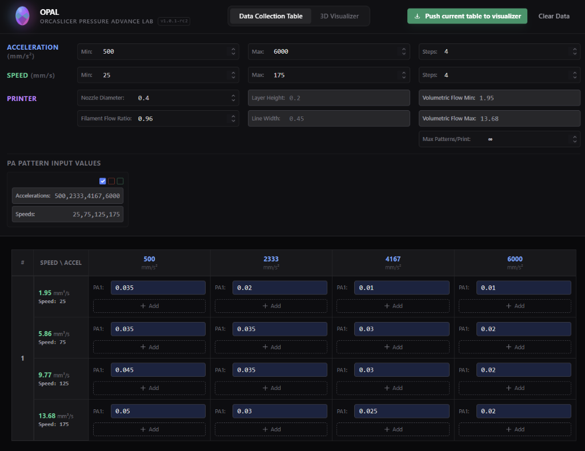
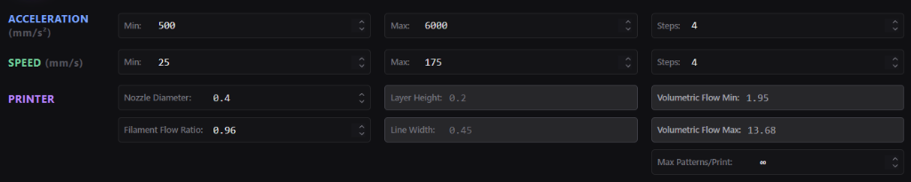
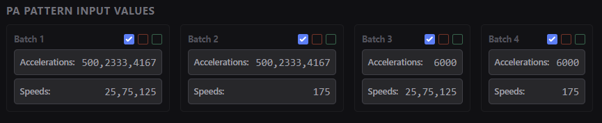
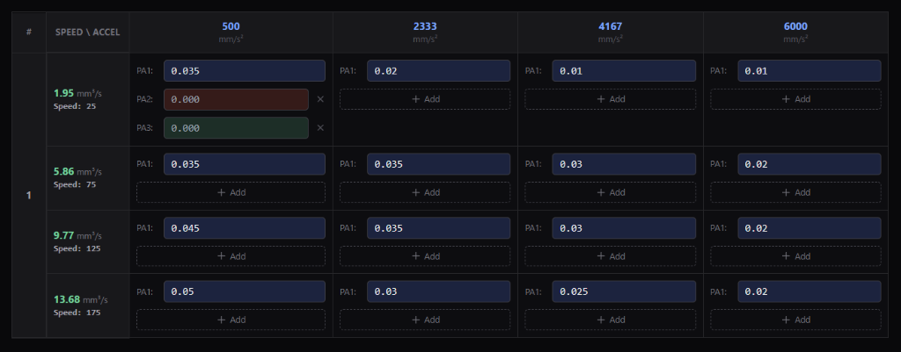
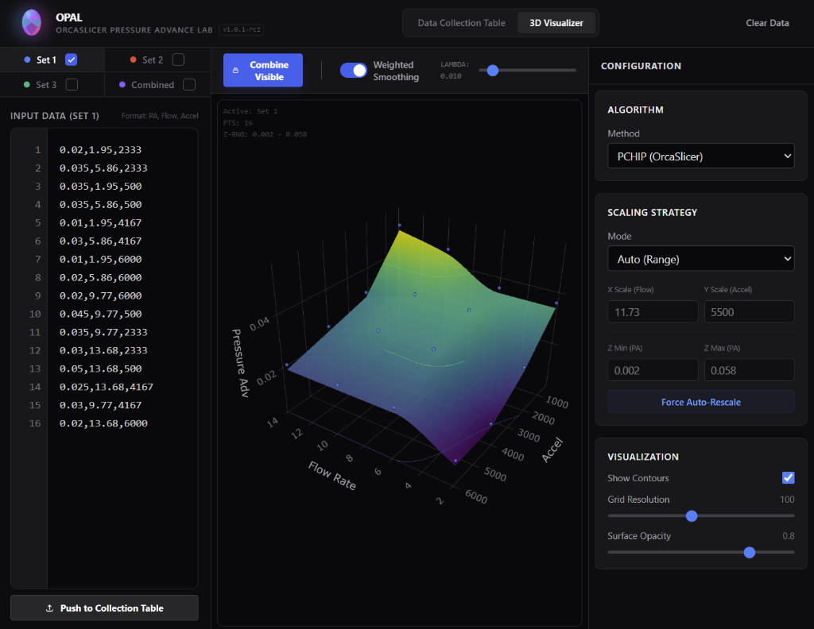
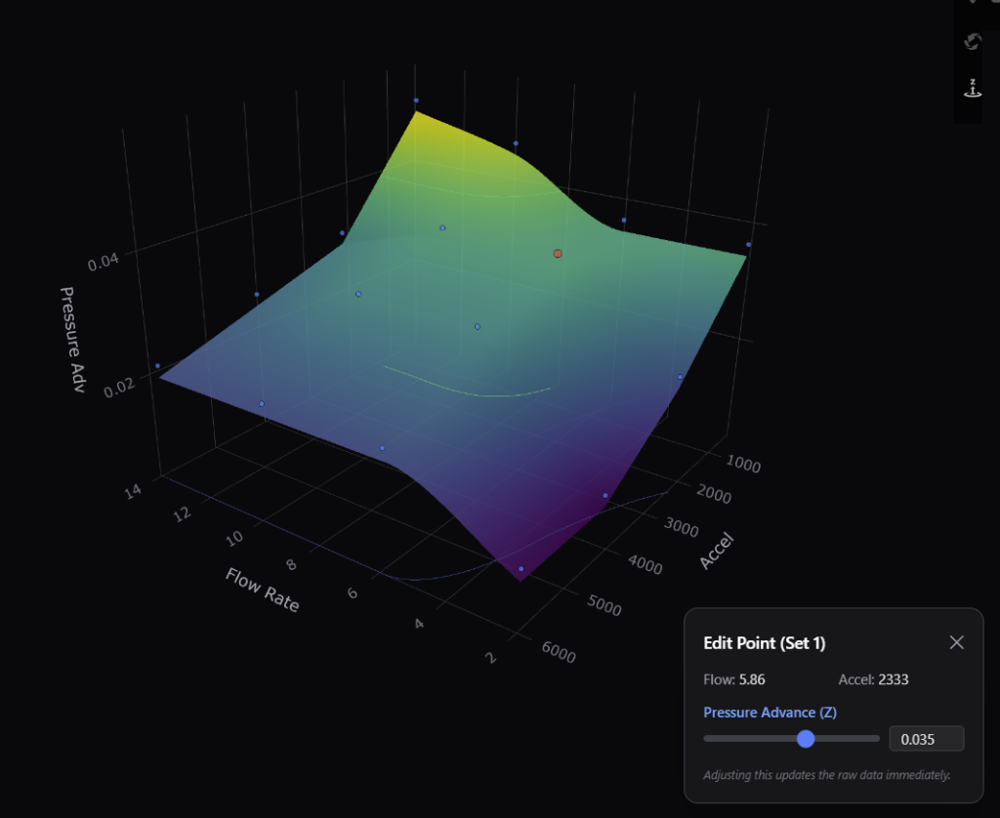
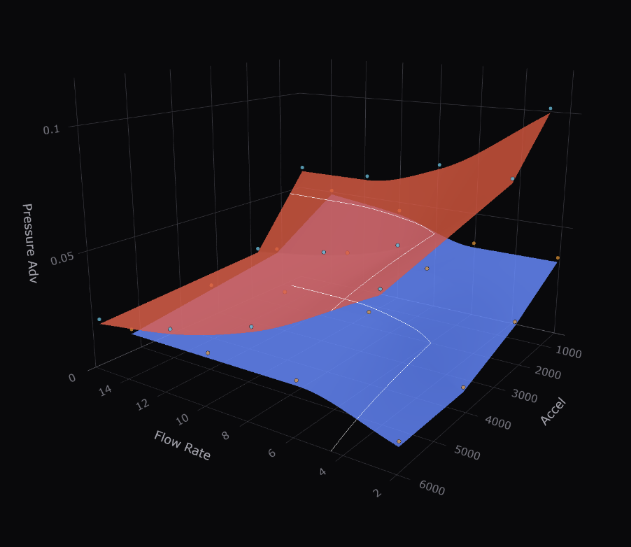
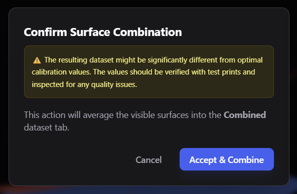
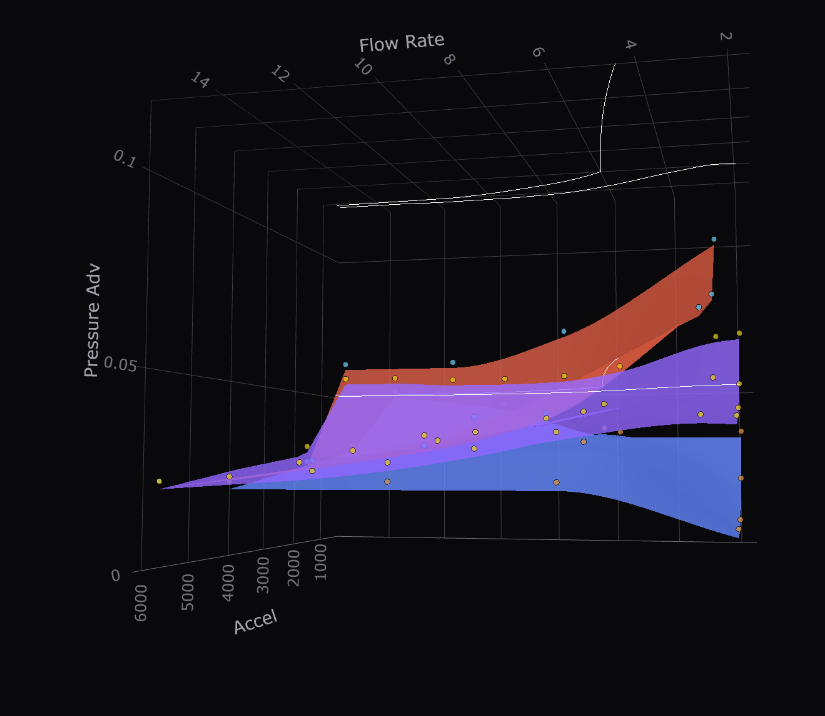
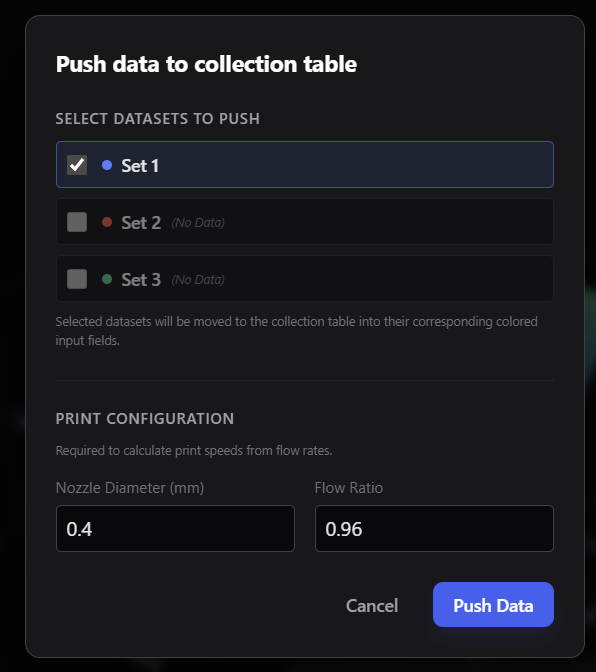

# OPAL - OrcaSlicer Pressure Advance Lab

**OPAL** is a dedicated tool for collecting, visualizing, and analyzing **Pressure Advance (PA)** settings for 3D printers. Built to work alongside modern slicers like **OrcaSlicer**, OPAL helps you fine-tune your extrusion consistency by providing a powerful 3D visualization of your PA test results across various speeds and accelerations.


_(Image: A full view of the OPAL Data Collection Dashboard)_

---

## 🚀 Key Features

- **Interactive Data Grid**: Automatically generates test coordinates based on your desired Speed and Acceleration ranges.
- **Smart Batching**: Automatically splits large test patterns into smaller batches to fit your printer's build plate.
- **3D Visualization**: View your calibration data as a 3D surface to identify trends and outliers, or characterize the general behavior of multiple brands of filament.
- **Multi-Pass Analysis**: Record multiple test runs and compare them simultaneously by overlaying datasets in 3D.
- **Advanced Smoothing**: Use weighted smoothing algorithms to generate a reliable "Average Surface" for the most accurate calibration.
- **Portable & Fast**: Lightweight application compatible with Windows.

---

## 📦 Installation

1.  Download the latest installer (`OPAL-Setup.exe`) from the **Releases** page.
2.  Run the installer and follow the on-screen prompts.
3.  Once installed, launch **OPAL** from your Start Menu or Desktop shortcut.

---

## 📖 User Guide & Tutorial

This guide will walk you through the complete workflow of using OPAL to calibrate your printer.

### Phase 1: Configuration & Pattern Generation

Before you print, you need to tell OPAL what you want to test.

1.  **Launch OPAL** and look at the **Data Collection Table** view.
2.  **Configure Printer Settings**:
    - Set your **Nozzle Size** (e.g., 0.4mm).
    - Set your **Filament Flow Ratio** (e.g., 0.98).
    - _Note: Layer Height is fixed at 0.2mm for standard PA testing._
3.  **Define Test Range**:
    - **Acceleration**: Choose a Min and Max (e.g., 500 to 3000 mm/s²) and the number of Steps.
    - **Speed**: Choose a Min and Max (e.g., 40 to 150 mm/s) and the number of Steps.
4.  **Automatic Grid Update**:
    - As you change these values, press either the green checkmark to update the grid or the red X to reset changes.
    - The grid will instantly update to show every combination of Speed and Acceleration to be tested.


_(Image: Close-up of the configuration sidebar showing Speed/Accel inputs)_

### Phase 2: Batching for Small Beds

If your test grid is too large for a single print:

1.  Locate the **Max Patterns/Print** setting.
2.  Enter the maximum number of squares your bed can fit (e.g., `6` or `9`).
3.  OPAL will automatically divide your test into **Batch 1**, **Batch 2**, etc.
4.  Print each batch one by one using your customized PA Pattern Generator. Use the values displayed in the "PA Pattern Input Values" boxes for each batch.
    - _Tip: Click directly on the values in OPAL to copy them to your clipboard._


_(Image: OPAL displays the specific Speed and Acceleration values to enter into OrcaSlicer for each batch)_

### Phase 3: Data Entry & Collection

Once your prints are done:

1.  Inspect the printed lines for each square.
2.  Measure or identify the best Pressure Advance (PA) value for that specific Speed/Accel combination.
3.  **Enter the Data**:
    - Find the corresponding cell in the OPAL grid.
    - Type the PA value into the input field.
    - **Multi-Pass**: If you printed the test twice (to verify), click **+ Add** to enter a second value for the same cell.


_(Image: The main grid showing filled-in PA values and multi-pass inputs)_

### Phase 4: 3D Visualization

Now simply click: **Push current table to visualizer** (Top Right).

The view will switch to the **3D Plot**. Here you can:

- **Rotate**: Left-click and drag.
- **Pan**: Right-click and drag.
- **Zoom**: Scroll wheel.


_(Image: The full 3D Visualizer tab view)_

- **Edit Points**: Click any point on the surface to fine-tune its value directly in the visualizer.


_(Image: The 3D plot showing a data surface with a point selected for editing)_

### Phase 5: Advanced Analysis (Combining & Smoothing)

1.  Enable multiple datasets (Set 1, Set 2) if you have them.
2.  **Toggle Visibility**: Use the checkboxes in the sidebar to show/hide specific surfaces.

    
    _(Image: Visualizing two simultaneous datasets)_

3.  **Enable Smoothing**: Toggle "Use Weighted Smoothing" in the toolbar if you want to filter out noise.
4.  **Adjust Lambda**: Use the slider to determine how much smoothing to apply (prior to combining).

    - _Low Lambda_: Keeps more raw detail.
    - _High Lambda_: Smooths out noise for a general trend.

    
    _(Image: The Combine/Average settings and slider are located in the top bar of the Visualizer)_

5.  **Combine**: Click **Combine Visible**. OPAL will average the visible surfaces into a new "Combined" dataset (purple).

    
    _(Image: Confirmation dialog with warning)_

    
    _(Image: The resulting combined surface shown in purple)_

### Importing & Pushing Back Data

If you have existing CSV data or want to modify your data in the Visualizer's text editor and send it back to the data collection table:

1.  Paste or Edit your data in the sidebar text editor (Format: `PA, Flow, Accel`).
2.  Click **Push to Collection Table**.
3.  Select which datasets to map to the grid.
4.  Ensure the correct nozzle diameter and flow ratio are selected.
5.  OPAL will validate the linearity of your data before importing.


_(Image: The 'Push to Collection' dialog allows you to sync text data back to the grid)_

---

## 🔧 Troubleshooting

- **Display Issues**: If the 3D plot looks squashed, try resizing the window or clicking "Force Auto-Rescale" in the controls.
- **Installer/Permissions**: Ensure you have write permissions to the folder where OPAL is installed, as it may save local configuration files.
- **Linearity Errors**: When pasting in existing PA calibration data, if you see an error about "Linearity", ensure your Speed and Acceleration steps were evenly spaced (e.g., 500, 1000, 1500... not 500, 600, 2000). Otherwise, they will not be compatible with the OPAL collection table grid.

---

## Attribution & Credits

- **[OrcaSlicer](https://github.com/SoftFever/OrcaSlicer)**: For the comprehensive calibration tools, community support, and the inspiration regarding Pressure Advance testing.
- **[Ellis' Print Tuning Guide](https://ellis3dp.com/Print-Tuning-Guide/)**: Specifically the [Pressure Linear Advance Tool](https://ellis3dp.com/Pressure_Linear_Advance_Tool/), which served as a foundational reference for the logical calculations and methodology.

---

## 💻 Development & Cross-Platform Usage

While the primary installer is for Windows, OPAL can be run on **macOS** and **Linux** directly from the source code.

### Running from Source

1.  **Prerequisites**: Install [Node.js](https://nodejs.org/) (LTS version recommended).
2.  **Clone the Repository**:
    ```bash
    git clone https://github.com/your-username/OPAL.git
    cd OPAL
    ```
3.  **Install Dependencies**:
    ```bash
    npm install
    ```
4.  **Run the App**:
    ```bash
    npm run electron
    ```

### Building for Other Platforms

To build a standalone executable (e.g., AppImage for Linux or DMG for Mac), run:

```bash
npm run electron:build
```

_Note: Building a Windows .exe usually requires running this command on Windows, and building a Mac .dmg usually requires macOS._

---

## License

This project is licensed under the **MIT License**. See the `LICENSE` file for details.
